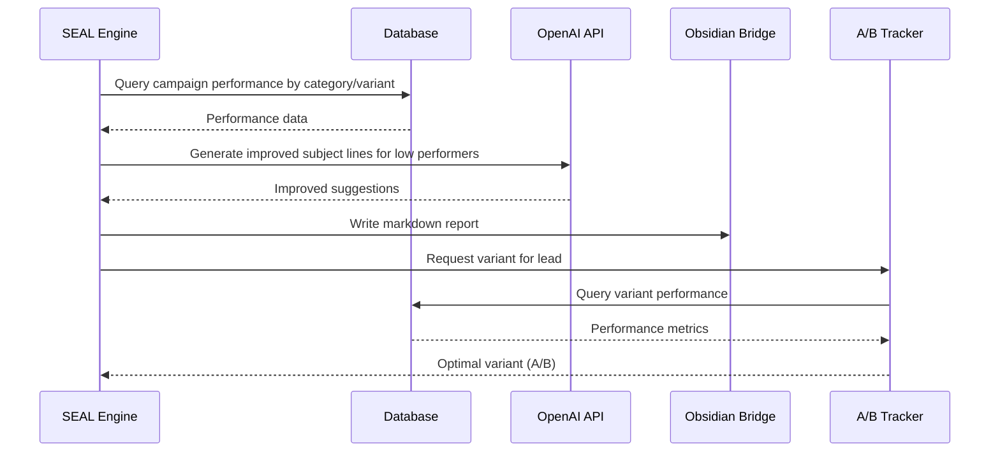

# Design Document: SEAL Engine & A/B Tracker

## Overview

The SEAL (Systematic Email Analysis & Learning) Engine analyzes email campaign performance data to generate improvement suggestions, while the A/B Tracker determines optimal email variants for leads based on historical performance data. The system runs periodic analysis cycles to optimize email marketing campaigns.

## Main Algorithm/Workflow



## Core Interfaces/Types

```python
from typing import TypedDict, Optional
from datetime import datetime

class CampaignPerformance(TypedDict):
    """Campaign performance data from database."""
    categoria: str
    variant: str
    total_sent: int
    opens: int
    clicks: int
    replies: int
    open_rate: float
    click_rate: float
    reply_rate: float

class ImprovementSuggestion(TypedDict):
    """AI-generated improvement suggestion."""
    original_subject: str
    improved_subject: str
    rationale: str
    confidence: float
    categoria: str
    variant: str

class SEALResult(TypedDict):
    """Result from SEAL engine run."""
    run_date: str
    analyzed_campaigns: int
    low_performers: int
    suggestions_generated: int
    report_path: str
    summary_stats: dict

class ABDecisionContext(TypedDict):
    """Context for A/B variant decision."""
    lead_id: int
    categoria: str
    variant_a_performance: Optional[CampaignPerformance]
    variant_b_performance: Optional[CampaignPerformance]
    total_data_points: int
    decision_reason: str
```

## Key Functions with Formal Specifications

### Function 1: run_seal_cycle()

```python
def run_seal_cycle() -> SEALResult:
    """
    Execute a complete SEAL analysis cycle.
    
    Returns:
        SEALResult: Dictionary containing analysis summary and report path
    """
```

**Preconditions:**
- Database connection to `E:\RED\red.db` is available
- OpenAI API key is configured in environment
- Obsidian bridge is accessible or fallback log directory exists
- Campaigns table contains recent email campaign data

**Postconditions:**
- Returns valid `SEALResult` object with all required fields
- If successful: `result["analyzed_campaigns"]` > 0
- If error: Exception is raised with descriptive message
- Markdown report is written to Obsidian or fallback log file
- Database `seal_insights` table is updated with analysis results

**Loop Invariants:** 
- For each campaign category: All variants are processed before moving to next category
- For low performers: Each gets exactly one improvement suggestion generated

### Function 2: get_variant()

```python
def get_variant(lead_id: int, categoria: str) -> str:
    """
    Determine optimal email variant (A/B) for a lead.
    
    Args:
        lead_id: Unique identifier for the lead
        categoria: Business category for targeting
    
    Returns:
        str: "A" or "B" indicating the optimal variant
    """
```

**Preconditions:**
- `lead_id` is a positive integer
- `categoria` is a non-empty string from valid categories
- Database contains `ab_experiments` table with performance data
- Campaigns table contains sent emails for analysis

**Postconditions:**
- Returns either "A" or "B" string
- Decision is deterministic for same input data
- If insufficient data (<10 sends per variant): returns random choice
- If both variants present: returns better performing variant
- Otherwise returns available variant

**Loop Invariants:**
- For performance comparison: All metrics are normalized before comparison
- For random selection: Seed is based on lead_id for reproducibility

## Algorithmic Pseudocode

### Main SEAL Processing Algorithm

```python
ALGORITHM run_seal_cycle
INPUT: None
OUTPUT: result of type SEALResult

BEGIN
    # Initialize counters and state
    result = initialize_result()
    today = datetime.now().strftime("%Y-%m-%d")
    
    # Phase 1: ANALYSIS PHASE
    performance_data = query_campaign_performance()
    result["analyzed_campaigns"] = len(performance_data)
    
    # Phase 2: IMPROVEMENT PHASE
    low_performers = filter_low_performers(performance_data, threshold=0.20)
    result["low_performers"] = len(low_performers)
    
    FOR EACH campaign IN low_performers DO
        ASSERT campaign["open_rate"] < 0.20
        
        suggestion = generate_improvement_suggestion(campaign)
        save_suggestion_to_db(suggestion)
        result["suggestions_generated"] += 1
    END FOR
    
    # Phase 3: LOGGING PHASE
    report_content = generate_markdown_report(result, performance_data, low_performers)
    
    TRY:
        write_to_obsidian(report_content, f"seal_{today}.md")
        result["report_path"] = f"04_seal_logs/seal_{today}.md"
    EXCEPT:
        write_to_fallback_log(report_content, f"logs/seal_{today}.md")
        result["report_path"] = f"logs/seal_{today}.md"
    
    # Phase 4: SUMMARY
    result["summary_stats"] = calculate_summary_stats(performance_data)
    result["run_date"] = today
    
    ASSERT result["analyzed_campaigns"] > 0
    ASSERT result["report_path"] is not None
    
    RETURN result
END
```

**Preconditions:**
- Database connection is available and tables exist
- OpenAI API is accessible with valid credentials
- Obsidian bridge or fallback log directory is writable

**Postconditions:**
- `result` contains complete analysis summary
- Markdown report is created in appropriate location
- `seal_insights` table contains generated suggestions
- All low performers have improvement suggestions

**Loop Invariants:**
- For each low performer: Original subject line is preserved in suggestion
- Suggestion confidence score is between 0.0 and 1.0

### A/B Tracker Decision Algorithm

```python
ALGORITHM get_variant
INPUT: lead_id of type int, categoria of type str
OUTPUT: variant of type str ("A" or "B")

BEGIN
    # Query performance data for this category
    variant_a_data = query_variant_performance(categoria, "A")
    variant_b_data = query_variant_performance(categoria, "B")
    
    total_data_points = 0
    IF variant_a_data IS NOT NULL THEN
        total_data_points += variant_a_data["total_sent"]
    END IF
    
    IF variant_b_data IS NOT NULL THEN
        total_data_points += variant_b_data["total_sent"]
    END IF
    
    # Decision logic
    IF total_data_points < 20 THEN  # <10 per variant on average
        # Insufficient data - random choice
        random.seed(lead_id)  # Deterministic based on lead_id
        variant = random.choice(["A", "B"])
        decision_reason = "insufficient_data_random"
        
    ELSE IF variant_a_data IS NOT NULL AND variant_b_data IS NOT NULL THEN
        # Both variants present - choose better performer
        a_score = calculate_variant_score(variant_a_data)
        b_score = calculate_variant_score(variant_b_data)
        
        IF a_score >= b_score THEN
            variant = "A"
            decision_reason = "variant_a_better_performance"
        ELSE
            variant = "B"
            decision_reason = "variant_b_better_performance"
        END IF
        
    ELSE IF variant_a_data IS NOT NULL THEN
        # Only variant A available
        variant = "A"
        decision_reason = "only_variant_a_available"
        
    ELSE IF variant_b_data IS NOT NULL THEN
        # Only variant B available
        variant = "B"
        decision_reason = "only_variant_b_available"
        
    ELSE:
        # No data at all - fallback to A
        variant = "A"
        decision_reason = "no_data_fallback_a"
    
    # Log decision for analytics
    log_ab_decision(lead_id, categoria, variant, decision_reason)
    
    RETURN variant
END
```

**Preconditions:**
- `lead_id` is valid positive integer
- `categoria` is from Config.CATEGORIES keys
- Database contains `ab_experiments` table

**Postconditions:**
- Returns "A" or "B" string
- Decision is logged for analytics
- Function is deterministic for same inputs

**Loop Invariants:**
- Score calculation uses same formula for both variants
- Random selection is seeded with lead_id for reproducibility

## Example Usage

```python
# Example 1: Run SEAL analysis cycle
from 06_seal.seal_engine import run_seal_cycle
from 06_seal.ab_tracker import get_variant

# Execute SEAL engine
result = run_seal_cycle()
print(f"Analyzed {result['analyzed_campaigns']} campaigns")
print(f"Generated {result['suggestions_generated']} improvements")
print(f"Report: {result['report_path']}")

# Example 2: Get optimal variant for a lead
lead_id = 42
categoria = "restaurante-bar"
optimal_variant = get_variant(lead_id, categoria)
print(f"Lead {lead_id} should receive variant {optimal_variant}")

# Example 3: Complete workflow
def send_optimized_email(lead_id: int, categoria: str):
    variant = get_variant(lead_id, categoria)
    
    # Get campaign template based on variant
    template = get_email_template(categoria, variant)
    
    # Personalize and send
    email_data = personalize_email(lead_id, template)
    send_email(email_data)
    
    # Track sending
    track_campaign_sent(lead_id, categoria, variant)

# Example 4: Error handling
try:
    result = run_seal_cycle()
    if result["low_performers"] > 0:
        print(f"Found {result['low_performers']} campaigns needing improvement")
except Exception as e:
    print(f"SEAL cycle failed: {e}")
    # Fallback to logging only
    log_error_to_file(e)
```

## Correctness Properties

1. **Deterministic Variant Selection**: For the same `lead_id` and `categoria`, `get_variant()` always returns the same result.
2. **Monotonic Improvement**: SEAL suggestions should not degrade performance (confidence score > 0.5).
3. **Data Integrity**: All database operations are atomic and preserve referential integrity.
4. **Fallback Behavior**: When Obsidian is unavailable, SEAL engine writes to local log directory.
5. **Performance Bounds**: SEAL analysis completes within 5 minutes for up to 1000 campaigns.
6. **Resource Safety**: Database connections are properly closed even on error.
7. **Input Validation**: All functions validate inputs before processing.
8. **Idempotent Operations**: Running SEAL cycle multiple times produces same analysis results.

## Error Handling

### Error Scenario 1: Database Connection Failure

**Condition**: Database file `E:\RED\red.db` is locked or unavailable
**Response**: Raise `sqlite3.Error` with descriptive message
**Recovery**: Retry after 1 second delay, maximum 3 attempts

### Error Scenario 2: OpenAI API Failure

**Condition**: OpenAI API returns error or timeout
**Response**: Skip improvement generation for affected campaigns
**Recovery**: Continue with remaining campaigns, log warning

### Error Scenario 3: Obsidian Bridge Failure

**Condition**: Obsidian REST API unavailable
**Response**: Write report to fallback log directory `logs/seal_{today}.md`
**Recovery**: Continue execution with local logging

### Error Scenario 4: Insufficient Performance Data

**Condition**: Less than 10 sends per variant in A/B tracker
**Response**: Return random choice seeded by `lead_id`
**Recovery**: Log decision reason for future analysis

## Testing Strategy

### Unit Testing Approach

**seal_engine.py**:
- Test database query returns correct performance data
- Test low performer filtering with threshold 0.20
- Test OpenAI integration mock
- Test report generation in markdown format
- Test fallback logging when Obsidian unavailable

**ab_tracker.py**:
- Test variant selection with sufficient data
- Test random fallback with insufficient data
- Test score calculation algorithm
- Test deterministic behavior with same inputs
- Test category validation

### Property-Based Testing Approach

**Property Test Library**: Hypothesis (Python)

**Properties to Test**:
1. `get_variant()` always returns "A" or "B"
2. Same inputs produce same variant (deterministic)
3. Variant selection respects performance data when available
4. SEAL cycle produces non-empty report
5. Improvement suggestions have confidence > 0.0

### Integration Testing Approach

- Test complete SEAL cycle with mock database
- Test A/B tracker integration with actual campaign data
- Test Obsidian bridge integration
- Test error recovery scenarios

## Performance Considerations

- **Database Optimization**: Use indexed queries on `categoria` and `variant` fields
- **Batch Processing**: Process campaigns in batches of 100 to avoid memory issues
- **API Rate Limiting**: Implement exponential backoff for OpenAI API calls
- **Caching**: Cache variant performance data for frequently accessed categories
- **Async Operations**: Consider async database queries for large datasets

## Security Considerations

- **API Keys**: OpenAI API key stored in environment variables, not in code
- **Database Security**: SQLite database file permissions restrict write access
- **Input Sanitization**: All database queries use parameterized statements
- **Error Messages**: Generic error messages to avoid information leakage
- **Log Security**: Sensitive data not logged in plain text

## Dependencies

- **Python 3.8+**: Core language runtime
- **sqlite3**: Built-in database library
- **openai**: OpenAI Python client for GPT suggestions
- **loguru**: Structured logging library
- **httpx**: HTTP client for Obsidian bridge (via existing `obsidian_bridge.py`)
- **python-dotenv**: Environment variable management (via existing `config.py`)